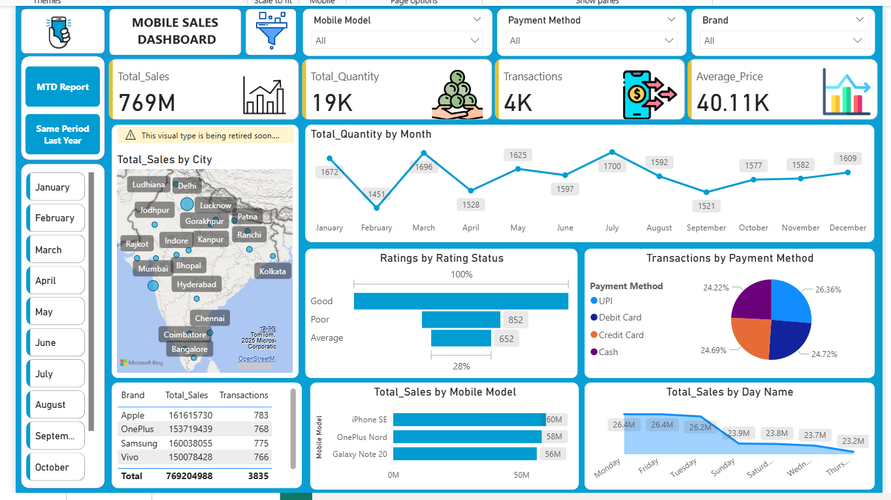

# 📊 Mobile Sales Dashboard

## 🧩 Overview
This **Mobile Sales Dashboard** is created using **Microsoft Power BI** to visualize and analyze mobile sales performance across different cities, brands, and payment methods.  
It helps track total sales, customer satisfaction, and sales trends to support data-driven business decisions.

---

## 🎯 Key Metrics
| Metric | Value |
|--------|--------|
| 💰 **Total Sales** | ₹769 Million |
| 📦 **Total Quantity Sold** | 19K Units |
| 🧾 **Total Transactions** | 4K |
| 💵 **Average Price** | ₹40.11K |

---

## 📍 Total Sales by City
Sales are spread across major Indian cities like **Mumbai, Delhi, Bangalore, Chennai, Hyderabad, Kolkata**, and more — providing regional insights into sales distribution.

---

## 📆 Total Quantity by Month
| Month | Quantity Sold |
|--------|----------------|
| January | 1672 |
| February | 1451 |
| March | 1696 |
| April | 1528 |
| May | 1625 |
| June | 1597 |
| July | 1700 |
| August | 1592 |
| September | 1521 |
| October | 1577 |
| November | 1582 |
| December | 1609 |

📈 **Highest Sales:** March (1696 units) & July (1700 units)  
📉 **Lowest Sales:** February (1451 units)

---

## ⭐ Ratings by Status
| Rating | Responses |
|--------|------------|
| Good | Majority |
| Poor | 852 |
| Average | 652 |

✅ **Customer satisfaction is high**, with most ratings marked as *Good*.

---

## 💳 Transactions by Payment Method
| Payment Method | Percentage |
|----------------|-------------|
| UPI | 26.36% |
| Debit Card | 24.22% |
| Credit Card | 24.69% |
| Cash | 24.72% |

💡 Almost equal preference for all payment methods — UPI leads slightly, showing the growth of digital transactions.

---

## 🏷️ Total Sales by Brand
| Brand | Total Sales | Transactions |
|--------|--------------|---------------|
| Apple | ₹161,615,730 | 783 |
| OnePlus | ₹153,719,439 | 768 |
| Samsung | ₹160,038,055 | 775 |
| Vivo | ₹150,078,428 | 783 |
| **Total** | **₹769,204,988** | **3835** |

---

## 📱 Total Sales by Mobile Model
| Model | Sales |
|--------|--------|
| iPhone SE | ₹60M |
| OnePlus Nord | ₹58M |
| Galaxy Note 20 | ₹56M |

---

## 📅 Total Sales by Day
| Day | Sales |
|------|--------|
| Monday | ₹26.4M |
| Friday | ₹26.4M |
| Tuesday | ₹26.2M |
| Sunday | ₹23.9M |
| Saturday | ₹23.8M |
| Wednesday | ₹23.7M |
| Thursday | ₹23.2M |

🗓️ **Peak Sales Days:** Monday, Friday, and Tuesday  
📉 **Lowest Sales Day:** Thursday

---

## 🧠 Insights & Business Impact
- **Consistent performance** across major brands and models.  
- **Digital payments** (especially UPI) are gaining strong traction.  
- **Customer feedback** is largely positive, indicating good product quality and service.  
- **Peak months** (March & July) are best suited for promotional campaigns.  
---

## 🛠️ Tools & Technologies
- **Power BI Desktop** – Data visualization  
- **Power Query** – Data cleaning and transformation  
- **Excel / CSV Dataset** – Data source  
- **DAX** – Custom measures and calculations  
---

## 📁 Project Files
- `Mobile_Sales_Dashboard.pbix` – Power BI report file  
- `Mobile_sales_data.csv` – Source dataset  
- `Dashboard.png` – Dashboard preview  
---

## 👩‍💻 Author
**Aashiya Ziya Shaikh**  
 💼 Aspiring Data Analyst  
📧 [aashiyaziya@gmail.com](mailto:aashiyaziya@gmail.com)

---

## 🖼️ Dashboard Preview

